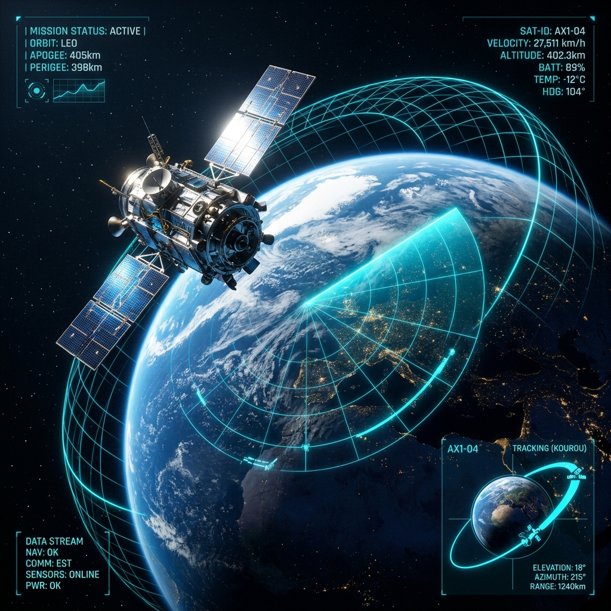

# 🚀 NeuroGrid Orbit

> **Tagline:** *One Grid. Infinite Intelligence.*



## 📌 Overview

**NeuroGrid Orbit** is a multi-agent AI decision-support platform engineered for satellite operators managing complex Low Earth Orbit (LEO) operational scenarios. By orchestrating six specialized AI agents, NeuroGrid Orbit rapidly evaluates orbital kinematics, collision risk indicators, mission priority trade-offs, and hypothetical evasive response paths — synthesizing the findings into a clear executive assessment.

> **Note:** NeuroGrid Orbit is engineered strictly as an **operational decision-support system**. It does **not** autonomously execute spacecraft control commands, maintaining strict human-in-the-loop safety authority.

---

## 🎯 Problem & Solution

### The Problem
Low Earth Orbit (LEO) is experiencing exponential growth in satellite constellations and space debris fragments. Satellite flight dynamics teams face critical operational friction:
* Exponential growth in trackable space object conjunctions.
* High velocity collision threats requiring rapid evaluation.
* Complex trade-offs between satellite payload mission priority and fuel budgets.
* Fragmented operational software requiring manual analysis across multiple independent tools.

### The Solution
NeuroGrid Orbit creates a collaborative constellation of specialized AI reasoning agents that examine the same orbital scenario concurrently, exchanging findings to synthesize actionable executive options.

---

## 🤖 Multi-Agent Architecture

```
                               ┌──────────────────────────┐
                               │ Satellite Scenario Input │
                               └────────────┬─────────────┘
                                            │
                               ┌────────────▼─────────────┐
                               │ 🎯 Coordinator Agent     │
                               └────────────┬─────────────┘
                                            │
            ┌───────────────────────────────┼───────────────────────────────┐
            │                               │                               │
┌───────────▼────────────┐     ┌────────────▼───────────┐      ┌────────────▼───────────┐
│ 🛰️ Orbit Agent         │     │ ⚠️ Risk Agent          │      │ 🎯 Mission Agent       │
│ Orbital Kinematics     │     │ Hazard & Conjunction   │      │ Payload & Priority     │
└───────────┬────────────┘     └────────────┬───────────┘      └────────────┬───────────┘
            │                               │                               │
            └───────────────────────────────┼───────────────────────────────┘
                                            │
                               ┌────────────▼─────────────┐
                               │ 🧪 Simulation Agent      │
                               │ Response Path Options    │
                               └────────────┬─────────────┘
                                            │
                               ┌────────────▼─────────────┐
                               │ 🧠 Decision Agent        │
                               │ Executive Synthesis      │
                               └──────────────────────────┘
```

### Agent Roles & Responsibilities

| Agent Icon | Agent Name | Core Responsibility |
| :--- | :--- | :--- |
| 🎯 | **Coordinator Agent** | Decomposes incoming orbital scenario parameters and delegates analysis tasks across the pipeline. |
| 🛰️ | **Orbit Agent** | Evaluates altitude, inclination, orbital regime (LEO), and kinematic boundary conditions. |
| ⚠️ | **Risk Agent** | Scans for conjunction indicators, debris proximity, solar flare drag spikes, and hazard factors. |
| 🎯 | **Mission Agent** | Weighs payload criticality, satellite health status, and mission priority against fuel trade-offs. |
| 🧪 | **Simulation Agent** | Generates hypothetical evasive maneuver response strategies (e.g. Prograde Burn, Radial Shift). |
| 🧠 | **Decision Agent** | Synthesizes all individual agent outputs into a unified Executive Decision Support Assessment. |

---

## ⚡ NVIDIA Nemotron & Nebius AI Integration

NeuroGrid Orbit harnesses **NVIDIA Nemotron** via **Nebius Token Factory / Nebius AI Cloud** for high-agency aerospace reasoning.

* **Target AI Model:** `nvidia/nemotron-3-super-120b-a12b`
* **API Base URL:** `https://api.tokenfactory.nebius.com/v1/`
* **Deterministic Local AI Engine Fallback:** The backend includes a robust local reasoning engine fallback. If Nebius API access or network connections are unavailable during development, NeuroGrid Orbit gracefully switches to local AI orchestration.

---

## 🛠️ Technology Stack

* **Frontend:** React 19, TypeScript, Tailwind CSS, shadcn/ui design tokens, Lucide Icons, Vite
* **Backend:** Python 3.10+, FastAPI, Uvicorn, Pydantic, `python-dotenv`, `openai` SDK
* **AI Engine:** NVIDIA Nemotron-3 Super 120B via Nebius Token Factory Cloud
* **Architecture:** NeuroGrid Multi-Agent Orchestration Pipeline

---

## 🚀 Getting Started & Local Running Guide

### Prerequisites
* Python 3.10+
* Node.js 18+ and npm

### 1. Clone Repository
```bash
git clone https://github.com/your-org/neurogrid-orbit.git
cd neurogrid-orbit
```

### 2. Configure Environment Variables
Create a `.env` file in the root directory (or update existing):
```env
NEBIUS_API_KEY=YOUR_NEBIUS_TOKEN_FACTORY_API_KEY
NEBIUS_MODEL=nvidia/nemotron-3-super-120b-a12b
```

### 3. Start Python FastAPI Backend
```bash
# Navigate to backend directory
cd backend

# Create virtual environment & install dependencies
python -m venv .venv
source .venv/bin/activate  # On Windows: .venv\Scripts\activate
pip install -r requirements.txt

# Launch FastAPI backend server on port 8000
uvicorn main:app --reload --port 8000
```
Backend API will be running at `http://localhost:8000`. Test endpoint: `http://localhost:8000/`

### 4. Start React Frontend
In a new terminal window:
```bash
cd frontend-react

# Install dependencies
npm install

# Start Vite dev server
npm run dev
```
Open your browser to `http://localhost:5173` to access the NeuroGrid Orbit Command Console.

---

## 📽️ 3-Minute YouTube Demo Video Flow

For hackathon video submission, use the following structured 3-minute presentation script:

* **0:00 – 0:15 | Problem & Vision**
  * Introduce dense LEO orbital hazards, space debris conjunction alerts, and satellite operator overload. Introduce NeuroGrid Orbit tagline: *"One Grid. Infinite Intelligence."*
* **0:15 – 0:35 | Scenario Input Console**
  * Enter satellite telemetry: `SAT-LEO-01` at 550 km altitude, 53° inclination, high priority. Select *Debris Conjunction Alert* preset.
* **0:35 – 1:20 | Multi-Agent Orchestration Flow**
  * Show Coordinator Agent decomposing scenario and delegating in real-time to Orbit Agent, Risk Agent, and Mission Agent nodes.
* **1:20 – 1:45 | Simulation Agent & Response Paths**
  * Showcase Simulation Agent generating hypothetical response trajectories (Prograde Evasive Burn vs. Radial Altitude Shift).
* **1:45 – 2:20 | Decision Agent Executive Synthesis**
  * Highlight the synthesized Executive Decision Assessment card, confidence score, and operator safety confirmation badge.
* **2:20 – 2:45 | Nebius + NVIDIA Nemotron Infrastructure**
  * Explain Nebius Token Factory inference using NVIDIA Nemotron-3 Super 120B model with deterministic fallback.
* **2:45 – 3:00 | Impact & Closing**
  * Emphasize human-in-the-loop safety design for next-gen satellite operators. Closing tagline: *"One Grid. Infinite Intelligence."*

---

## 📜 License

Distributed under the **MIT License**. See [`LICENSE`](LICENSE) for details.

---

## 🏆 Hackathon Details

* **Track:** Best Apps and Agents
* **Project Name:** NeuroGrid Orbit
* **Submission Version:** v1.0.0
